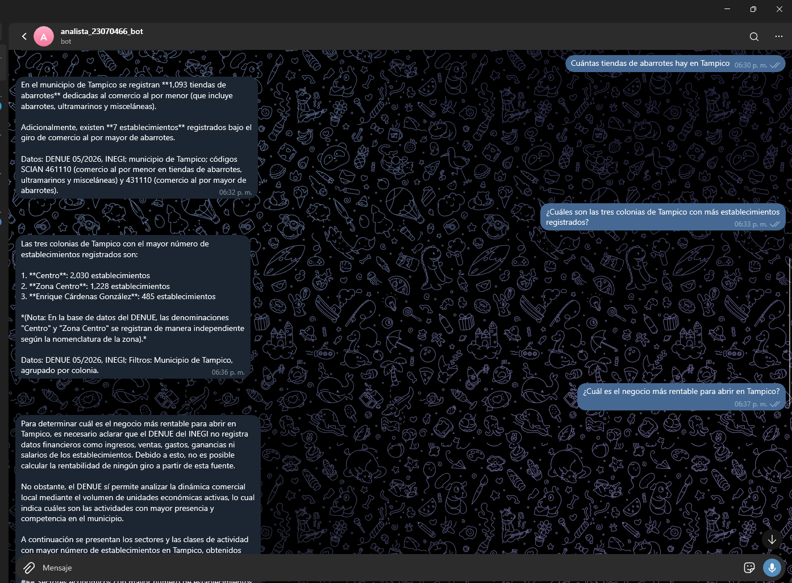

# Agente Analista del DENUE (Tampico y Ciudad Madero)

Agente inteligente en Python basado en la API de Google Gemini (modelo `gemini-3.6-flash`) y herramientas determinísticas con Pandas para analizar el Directorio Estadístico Nacional de Unidades Económicas (DENUE 05/2026, INEGI) en los municipios de Tampico y Ciudad Madero, Tamaulipas.

## 📌 Características Principales

1. **Arquitectura Percibir-Decidir-Actuar:** Ciclo multi-turno donde el LLM solicita herramientas de análisis y el agente ejecuta las consultas de manera segura.
2. **Cero Cálculos en el LLM:** Todas las cifras, conteos, rankings y agrupaciones son realizados exclusivamente por código Python sobre los microdatos del DENUE.
3. **Guardia de Cifras:** Validación automática que detecta números o cálculos no respaldados en la pregunta o en los datos devueltos por las herramientas, solicitando al modelo la corrección inmediata.
4. **Interfaces Múltiples:** 
   - **CLI (Terminal):** Ejecución de preguntas individuales en consola.
   - **Lote:** Ejecución automatizada de bancos de preguntas con bitácora estructurada en formato `.jsonl`.
   - **Bot de Telegram:** Interfaz conversacional con ejecución asíncrona mediante `asyncio.to_thread` y lista blanca de usuarios autorizados.

---

## 📁 Estructura del Proyecto

```text
analista-denue-23070466/
├── app/
│   ├── __init__.py
│   ├── agente.py           # Ciclo principal del agente y ejecutor de herramientas
│   ├── bot.py              # Interfaz de bot para Telegram (python-telegram-bot)
│   ├── cli.py              # Interfaz de línea de comandos (CLI)
│   ├── evaluar.py          # Script de evaluación de respuestas vs esperadas
│   ├── guardia.py          # Guardia de cifras y extracción de números
│   ├── herramientas.py     # Normalización, filtros Pandas y declaraciones JSON
│   ├── lote.py             # Ejecución por lotes del banco de prueba
│   ├── modelo.py           # Integración con Google GenAI SDK (automatic_function_calling=False)
│   └── modelo_simulado.py  # Modelo simulado de 4 pasos para desarrollo y pruebas
├── data/
│   ├── denue_tampico_madero.csv
│   ├── mini_denue.csv
│   ├── preguntas_prueba.json
│   └── sectores_scian.csv
├── evaluacion/
│   ├── __init__.py
│   ├── analisis.md         # Análisis cualitativo y cuantitativo del desempeño
│   ├── calcular_esperadas.py # Generador de respuestas esperadas sin importar app/
│   ├── esperadas.json      # Banco de respuestas esperadas y criterios
│   └── resultados.json     # Resultados de la evaluación automática
├── evidencia/              # Capturas de pantalla y evidencias de funcionamiento
├── logs/                   # Bitácoras de ejecución (.jsonl)
├── prompts/
│   └── sistema.md          # Instrucciones del sistema en español
├── pruebas/
│   ├── __init__.py
│   └── prueba_herramientas.py # 23 pruebas unitarias para herramientas
├── .env.example
├── .gitignore
├── README.md
├── requirements.txt
├── traza_manual.md
└── verificar_entrega.py
```

---

## 🚀 Instalación y Configuración

### 1. Clonar el repositorio y crear entorno virtual

```bash
git clone <URL_DEL_REPOSITORIO>
cd analista-denue-23070466
python -m venv venv
# En Windows:
venv\Scripts\activate
# En Linux/macOS:
source venv/bin/activate
```

### 2. Instalar dependencias

```bash
pip install -r requirements.txt
```

### 3. Configurar variables de entorno

Copia el archivo `.env.example` a `.env` e ingresa tus credenciales:

```bash
cp .env.example .env
```

Edita `.env`:
```env
GEMINI_API_KEY=tu_api_key_aqui
GEMINI_MODEL=gemini-3.5-flash
TELEGRAM_BOT_TOKEN=tu_token_telegram_aqui
TELEGRAM_USUARIOS_PERMITIDOS=12345678,87654321
```

---

## 🧪 Ejecución de Pruebas Unitarias

Para verificar que las herramientas funcionen correctamente y pasen las 23 comprobaciones:

```bash
python -m unittest pruebas/prueba_herramientas.py
```

---

## 💻 Uso de las Interfaces

### 1. Consulta individual vía CLI

Con modelo real de Gemini:
```bash
python -m app.cli "¿Cuántas farmacias hay en Tampico?"
```

Con modelo simulado (sin consumo de API):
```bash
python -m app.cli "¿Cuántas farmacias hay en Tampico?" --simulado
```

### 2. Ejecución por Lote

Ejecutar todo el banco de preguntas en modo simulado:
```bash
python -m app.lote --simulado
```

Ejecutar con el modelo real:
```bash
python -m app.lote --desde P01 --hasta P10
```

### 3. Bot de Telegram

Iniciar el bot:
```bash
python -m app.bot
```

---

## 📊 Evaluación y Verificación

1. Calcular respuestas esperadas:
```bash
python evaluacion/calcular_esperadas.py
```

2. Evaluar bitácoras reales:
```bash
python -m app.evaluar logs/corrida-YYYYMMDD-HHMMSS.jsonl
```

3. Verificar requisitos de entrega:
```bash
python verificar_entrega.py
```

## Decisiones de diseño y límites

- El modelo decide qué herramienta solicitar; `app/agente.py` ejecuta únicamente las cuatro herramientas declaradas y mantiene desactivada la ejecución automática del SDK.
- El ciclo limita cada pregunta a 5 turnos del modelo y 6 ejecuciones de herramientas. Si se alcanza el límite, se fuerza una respuesta de texto.
- `app/guardia.py` compara las cifras de la respuesta con la pregunta y con los resultados devueltos por las herramientas. Si encuentra cifras sin respaldo, solicita una corrección y, si persisten, muestra un aviso.
- `codigo_act` se conserva como texto y se interpreta como uno o varios prefijos SCIAN separados por comas. Antes de contar un giro se usa `buscar_actividades` para identificar las clases pertinentes.
- El DENUE no proporciona empleados exactos, ventas, ingresos, utilidades, salarios ni opiniones; el agente debe declarar esa limitación.

## Bot de Telegram

1. Crear el bot con `/newbot` en `@BotFather` y guardar el token únicamente en `.env`.
2. Obtener el identificador numérico de Telegram y colocarlo en `TELEGRAM_USUARIOS_PERMITIDOS`, separado por comas si hay más de un usuario.
3. Ejecutar `python -m app.bot` mientras se hacen las preguntas desde el celular. Para probar sin consumir la API: `python -m app.bot --simulado`.

El bot solo recibe el texto y llama a `app.agente.responder`; no contiene lógica de análisis. Ejecuta la llamada bloqueante en otro hilo, muestra el estado “escribiendo…”, divide respuestas de más de 4,096 caracteres y registra un identificador anónimo del usuario.

### Evidencia de Funcionamiento



## Estado de la evaluación

La evaluación final debe ejecutarse después de completar las diez preguntas reales y las tres preguntas reales desde Telegram. Las cifras de `evaluacion/resultados.json` y el análisis deben corresponder a esa corrida; no deben copiarse de una ejecución anterior ni editarse manualmente.

## Declaración de uso de asistentes

Se utilizó un asistente de inteligencia artificial para apoyar la revisión y depuración del código, la documentación y la organización de pruebas. El autor verificó las decisiones, las cifras calculadas con pandas y el funcionamiento del programa; la traza de la Parte E debe ser elaborada y comprobada personalmente antes de la entrega.
